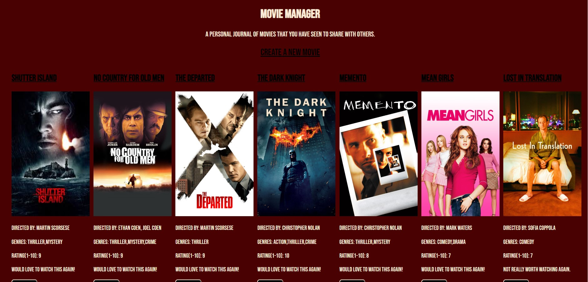
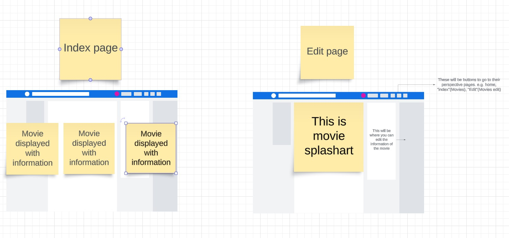

# MovieManager

#### A full-stack web application built using Node.js, Mongoose, Express and EJS.

## Description
Movie Manager is a personal database of movies that you have seen that you can share with others. You can remove, edit and add movies at your leasure. 

## WireFrame
* 

## Table of Contents
* [Technologies Used](#technologiesused)
* [Features](#features)
* [Design](#design)
* [Project Next Steps](#nextsteps)
* [Deployed App](#deployment)
* [About the Author](#author)

## Technologies Used
* JavaScript
* HTML
* CSS
* EJS
* Mongoose
* Express

## Features
* Users can add movies to the database
* Users can remove movies from the database
* Users can edit movies in the database

## Design
* Design elements implemented using HTML and CSS. 

## Project Next Steps
* Add more datapoints so users can find a specfic movie by genre, rating and wether they would want to watch it again. 
* Implement further CSS so the user can choose between different themes by pressing buttons.

## Deployed Link
[Github](https://jafbath.github.io/movieManager/)

* You can view the repository:
[Github.com](https://github.com/jafbath/movieManager)
* If unable to view please go live locally through VS Code

## About the Author
* This was a challenging project for me not being very comfortable with mongoose and express. I do feel more comfortable than I did previous to this project as I spent more time with the code.
* 
    
## Works Cited:
* lots of w3schools.com... Mainly for the new.ejs and a couple things with css.

